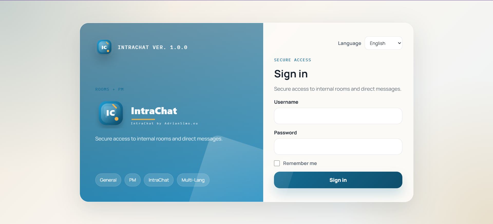
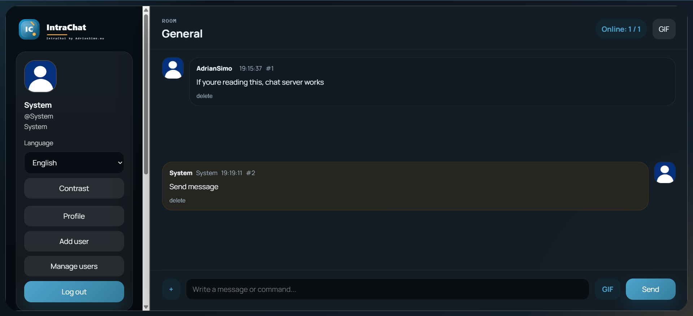
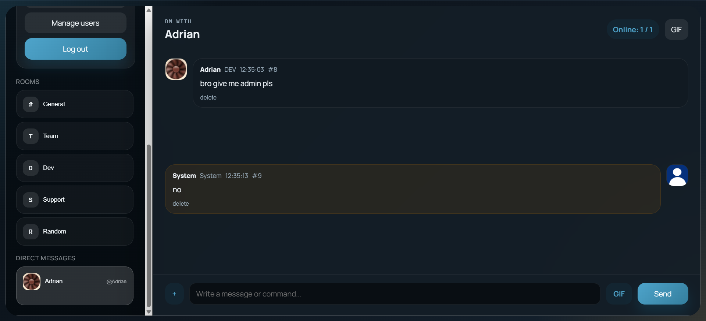
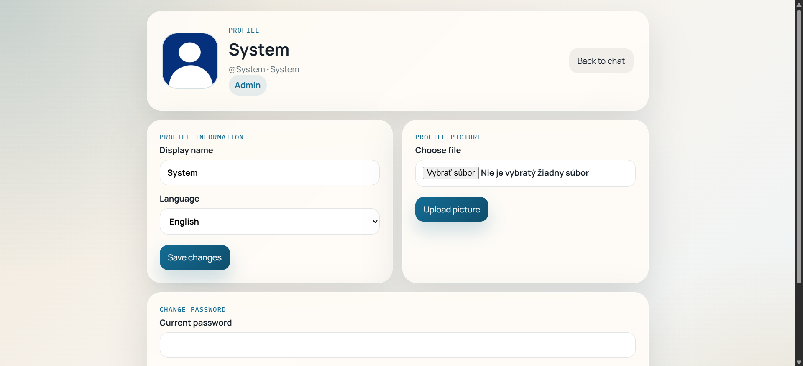
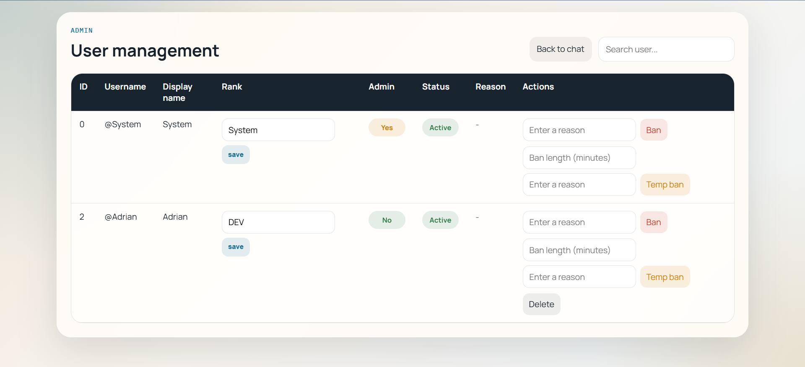

# IntraChat

IntraChat is a real-time internal chat application built with Flask, Flask-SocketIO, and SQLite. It is designed for teams, schools, and small communities that need a lightweight self-hosted chat with moderation tools, direct messages, uploads, and simple administration.

## Overview

- Real-time public rooms and private conversations
- User accounts with display names, ranks, avatars, and language preferences
- Admin moderation with bans, temporary bans, pinning, room clearing, and role changes
- File uploads, image/video/audio previews, and Tenor GIF search
- Dark mode, multi-language UI, and dynamic SVG branding driven by configuration
- Discord webhook logging for admin actions and system activity

## Current State

The project is configured to run directly from the repository with the included SQLite database layout. If you keep the bundled database snapshot in `instance/chat.db`, the default account is:

- Username: `System`
- Password: `system`

Change that password immediately after first login.

## Technology Stack

- Python 3.11+
- Flask
- Flask-Login
- Flask-SocketIO
- Flask-SQLAlchemy / SQLAlchemy
- eventlet
- SQLite
- Vanilla HTML, CSS, and JavaScript
- Discord Webhook API
- Tenor GIF API

## Main Features

### Chat

- Real-time message delivery over Socket.IO
- Public chat rooms and private PM threads
- Persistent message history
- Pinned messages per public room
- Styled admin announcements using the `ANNOUNCEMENT:` prefix

### User Experience

- Login flow with session handling
- Profile editing with display name, avatar upload, and password change
- Supported UI languages: Slovencina, English, Polski
- Light and dark theme support
- Browser notifications for incoming messages

### Moderation

- Permanent bans and temporary bans
- Ban reason and expiration tracking
- Admin-only room clearing
- Admin-only pin and unpin actions
- `System` account can grant or revoke admin rights via chat commands

### Integrations

- Discord webhook logging for moderation and admin actions
- Tenor-powered GIF search
- Dynamic app naming and SVG logo generation from configuration

## Interface Preview

### Login



### Chat Views

| General Room | Private Messages |
| --- | --- |
|  |  |

### Profile and Administration

| User Profile | User Management |
| --- | --- |
|  |  |

## Project Structure

```text
.
├── intrachat.py               # Main Flask application and Socket.IO handlers
├── database.py                # SQLAlchemy models
├── config.json                # Local configuration fallback
├── requirements.txt           # Python dependencies
├── lang/                      # Translation files
├── templates/                 # Jinja templates
│   ├── branding/              # SVG logo templates
│   ├── chat.html
│   ├── login.html
│   ├── admin_users.html
│   └── ...
├── static/                    # CSS and static assets
├── instance/                  # SQLite database storage
├── propic/                    # User avatars
└── uploads/                   # Uploaded files
```

## Getting Started

### 1. Download the repository

```bash
git clone https://github.com/adriansimo2008/intrachat.git
cd intrachat
```

Or download release

### 2. Install dependencies

```bash
pip install -r requirements.txt
```

### 3. Configure the application

You can configure the app through environment variables or `config.json`. Environment variables take precedence where supported.

Example `config.json`:

```json
{
  "app_name": "IntraChat",
  "discord_webhook_url": "discord_webhook_url_HERE",
  "server_id": "IntraServer1",
  "tenor_api_key": "tenor_api_key_HERE",
  "FLASK_SECRET_KEY": "",
  "FLASK_DEBUG": "False"
}
```

- `FLASK_SECRET_KEY` - **MANDATORY** secret key for Flask sessions. The application will refuse to start without this. Generate one with: `python -c 'import secrets; print(secrets.token_hex(32))'`

### 4. Start the server

```bash
python intrachat.py
```

I recomend using [astral - UV](https://github.com/astral-sh/uv) then you will need to setup it like this

```bash
uv venv
uv pip install -r requirements.txt
```

and run it with

```bash
uv run intrachat.py
```

The app runs on `0.0.0.0:5000` by default.

## Configuration Reference

### Environment variables

- `APP_NAME`: Overrides the application name used in the UI and generated SVG logos
- `DISCORD_WEBHOOK_URL`: Discord webhook for admin and moderation logs
- `SERVER_ID`: Server label used in Discord log messages
- `TENOR_API_KEY`: Enables GIF search
- `FLASK_SECRET_KEY`: Required secret for Flask sessions if not present in `config.json`
- `FLASK_DEBUG`: Set to `true` to enable debug mode

### `config.json` options

- `app_name`
- `discord_webhook_url`
- `server_id`
- `tenor_api_key`
- `FLASK_SECRET_KEY`
- `FLASK_DEBUG`
- `chat_rooms`

## Routes

- `/` and `/login`: Login page
- `/logout`: End session
- `/chat`: Main chat interface
- `/user/<id>`: User profile
- `/change_password`: Password change page
- `/add_user`: Admin-only user creation
- `/admin/users`: Admin-only user management
- `/history`: Conversation history JSON
- `/pinned`: Current pinned message JSON
- `/upload`: File upload endpoint
- `/uploads/<filename>`: Uploaded file access
- `/brand/mark.svg`: Monogram logo
- `/brand/wordmark.svg`: Full SVG wordmark

## Chat Commands

### General

- `/version`
- `/date`
- `/time`
- `/help`
- `/rules`
- `/uptime`
- `/server-uptime`

### Admin

- `/clear`
- `/pin <message_id>`
- `/unpin <message_id>`
- `/ban <username> <reason>`
- `/unban <username>`
- `/tempban @<username> <duration> <reason>`

### `System` account only

- `/makeadmin <username>`
- `/deladmin <username>`

### Special admin message format

- `ANNOUNCEMENT: your text here`

## Database Models

### `User`

- Authentication and profile data
- Admin flag
- Ban state, reason, and expiry
- Avatar path
- Preferred language

### `ChatMessage`

- Message content
- Timestamp
- Pinned state
- Room or PM key

### `ban_log`

- Moderation history with type, target user, admin, and reason

### `IPLog`

- Username, IP address, and timestamp for audit logging

## Deployment Notes

- The application is suited for always-on environments that support WebSockets
- SQLite is the default database and is stored under `instance/chat.db`
- File uploads are stored in `uploads/`
- Avatar uploads are stored in `propic/`
- System announcements are emitted periodically in the background

## Security Notes

- Passwords are hashed with Werkzeug security utilities
- Upload filenames are sanitized with `secure_filename`
- Bans are enforced on both HTTP routes and Socket.IO connections
- Admin actions can be logged externally through Discord webhooks

## License

This project uses a custom license for personal or internal use only.

- Forking and modification are allowed for personal or internal use
- Public redistribution is not allowed

See [LICENSE](LICENSE) for the exact terms.
